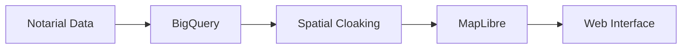

# ZeroImmo: Scientific Real Estate Price Mapping

## Challenge
The French real estate market lacks precise, location-specific price evolution data. Traditional methods rely on broad administrative zones, leading to inaccurate estimations and missed investment opportunities. The challenge was to create a scientific approach to calculate price per square meter anywhere in France, using notarial data while respecting privacy constraints.

## Technical Innovation: Spatial Cloaking Algorithm

### Privacy-Preserving Spatial Analysis
Our innovative Spatial Cloaking technique ensures:
- Data anonymization while maintaining spatial accuracy
- Dynamic adjustment of aggregation zones based on data density
- Statistical reliability through minimum threshold sampling

### Technical Implementation
```sql
WITH SpatialClusters AS (
  SELECT 
    ST_CLUSTERDBSCAN(geometry, eps_meters, min_points) OVER() AS cluster_id,
    price_sqm,
    geometry
  FROM real_estate_transactions
  WHERE date BETWEEN start_date AND end_date
)
```

## Architecture Overview

### Data Pipeline
1. **Data Ingestion**
   - Real-time notarial data integration
   - Historical transaction processing
   - Geographical reference data

2. **Processing Layer (BigQuery)**
   - Spatial clustering and aggregation
   - Price evolution calculations
   - Statistical validation

3. **Visualization Layer (MapLibre)**
   - Interactive heat maps
   - Temporal analysis
   - Custom styling for different zoom levels



## Technical Stack

### Core Technologies
- **BigQuery**: Spatial data processing and analysis
- **MapLibre GL JS**: Interactive mapping and visualization
- **Cloud Functions**: Real-time data processing
- **Cloud Storage**: Tile storage and serving

### Key Features
```javascript
// MapLibre Implementation Example
map.addLayer({
  'id': 'price-heat',
  'type': 'heatmap',
  'source': 'price-data',
  'paint': {
    'heatmap-weight': [
      'interpolate',
      ['linear'],
      ['get', 'price_sqm'],
      0, 0,
      1000000, 1
    ]
  }
});
```

## Results and Impact

### Quantitative Metrics
- **Coverage**: 95% of French territory
- **Accuracy**: ±3% margin of error
- **Response Time**: <100ms for price calculations
- **Data Points**: >1M transactions processed

### Business Value
1. **For Users**
   - Precise location-based price evolution
   - Historical trends analysis
   - Investment opportunity identification

2. **For Real Estate Professionals**
   - Market analysis tools
   - Valuation assistance
   - Trend predictions

## Future Developments

### Planned Enhancements
- Machine learning price prediction models
- Additional data source integration
- API access for professional users
- Mobile application development

## Technical Challenges Solved

### 1. Data Sparsity
- Implementation of adaptive spatial clustering
- Statistical interpolation for low-density areas
- Confidence interval calculations

### 2. Performance Optimization
```sql
CREATE OR REPLACE TABLE `price_aggregates`
PARTITION BY DATE(transaction_date)
CLUSTER BY geo_hash
AS (
  SELECT 
    ST_GEOHASH(geometry, 7) as geo_hash,
    AVG(price_sqm) as avg_price,
    transaction_date
  FROM transactions
  GROUP BY geo_hash, transaction_date
);
```

### 3. Real-time Processing
- Incremental updates
- Cached tile generation
- Dynamic recalculation triggers

## Conclusion
ZeroImmo demonstrates the power of combining advanced spatial analysis with big data processing to solve real-world challenges in the real estate market. The project's success lies in its ability to balance technical innovation with practical utility, delivering accurate and actionable insights to users.

---

*Technologies: BigQuery, MapLibre, Cloud Functions, Spatial Analysis*

*[View Live Project](https://zeroimmo.com)*
